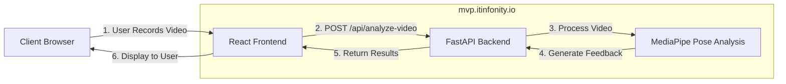

# AI Physical Therapy Assistant API

This is the backend API for the AI Physical Therapy Assistant application.

## Recent Optimizations

### Video Analysis Performance Improvements

- Implemented asynchronous video processing to prevent timeouts
- Added background tasks for handling long-running analysis
- Significantly reduced processing load by:
  - Sampling every 5th frame instead of every 2nd frame
  - Limiting analysis to 10 seconds of video (300 frames) instead of 20 seconds
  - Lowering detection confidence thresholds from 0.5 to 0.3 for better detection
  - Adding fallbacks when detection fails

### Position Check Improvements

- More lenient position detection (2 out of 3 criteria required instead of all 3)
- Increased thresholds for all measurements to allow for natural variation
- Added fallback to allow users to proceed after 3 failed checks
- Better error handling with progressive fallbacks

### Feedback Quality Improvements

- Guaranteed minimum positive feedback (25%) in all cases
- Minimum form quality set to 60% to encourage users
- More varied and specific feedback messages
- Always counts at least 1 repetition even if detection fails
- Random positive reinforcement added when no positive cues detected

## API Endpoints

- `GET /`: Health check
- `POST /api/check-position`: Checks starting position
- `POST /api/analyze-video`: Initiates video analysis (now asynchronous)
- `GET /api/analysis-status/{video_id}`: Polls for analysis results
- `GET /{full_path:path}`: Serves static files

## Frontend Updates

- Implemented polling for async video processing results
- Added progress indication with animated loading bar
- Better error handling and recovery
- Improved user feedback during analysis

## Production Domain

The application is now deployed and available at: **https://mvp.itinfonity.io**

## API Configuration

The application uses an environment variable to configure the API endpoint URL. By default, it points to `https://mvp.itinfonity.io`.

### Important: Setting up the API URL

1. Create a `.env` file in the root directory of the project (same level as package.json)
2. Add the following line to the file:
   ```
   REACT_APP_API_URL=https://mvp.itinfonity.io
   ```
3. Restart the development server if it's running

Note: Environment variables in Create React App must start with `REACT_APP_` to be recognized.

## System Architecture



## New Features in MVP

### 1. In-Browser Video Recording
- Record video directly via mobile or desktop browser with controls for starting/stopping
- Preview recorded video before submission
- Optimized for both mobile and desktop browsers

### 2. Start Position Verification
- Real-time detection of proper starting position:
  - Hands under shoulders
  - Knees under hips (90° alignment)
  - Feet flat to ground
  - Toes inward, heels outward (for toe drive)
- Visual feedback on correct positioning before starting exercise

### 3. Exercise Selection
- Support for two exercise types:
  - Quadruped Rock
  - Toe Drive Rock (with toe-ground detection)
- Exercise-specific feedback and analysis

### 4. Enhanced Movement Tracking
- Detection of key movement aspects:
  - Foot movement and stability
  - Head drop / eye direction
  - Ankle collapse
  - Toe drive (toe pressing down)

### 5. Comprehensive Feedback System
- Intelligent analysis of form and technique
- Text feedback for movement quality
- Visual overlay of skeletal tracking
- Automatic repetition counting

### 6. Error Handling
- Clear messages for detection issues
- Instant feedback when body parts aren't visible
- Option to re-record immediately

### 7. Mobile Optimization
- Rear camera option for better body visibility
- Responsive design optimized for mobile devices
- Clean and intuitive user interface

## API Endpoints

The backend provides the following API endpoints:

- `GET /`: Health check endpoint
- `POST /api/analyze-video`: Analyze uploaded video and return feedback
- `POST /api/check-position`: Verify starting position from a single frame
- `GET /{full_path:path}`: Serve the React app for all other paths

## Performance Optimization

- Efficient frame sampling for faster processing
- Pre-check for empty video files
- Limited analysis duration for better user experience
- Optimized pose detection parameters

## Features

- Real-time pose detection and analysis
- Color-coded visualization of body segments
- Detailed feedback on movement quality
- Session summary with metrics
- Repetition counting and form analysis

## Troubleshooting

If you encounter a "Failed to fetch" error when analyzing videos:
1. Check that the API server is running and accessible
2. Verify that the API URL configuration is correct
3. Open the browser console to see the actual API URL being used

## Quick Start

### Backend
```
cd Backend/app
pip install -r req.txt
uvicorn main:app --reload --host 0.0.0.0 --port 8000
```

### Frontend
```
cd Frontend/AI-Physical-Therapy-Assistant-main
npm install
npm start
```

Visit http://localhost:3000 in your browser to use the application.
